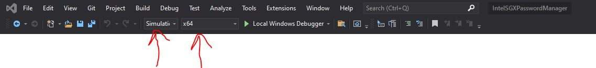
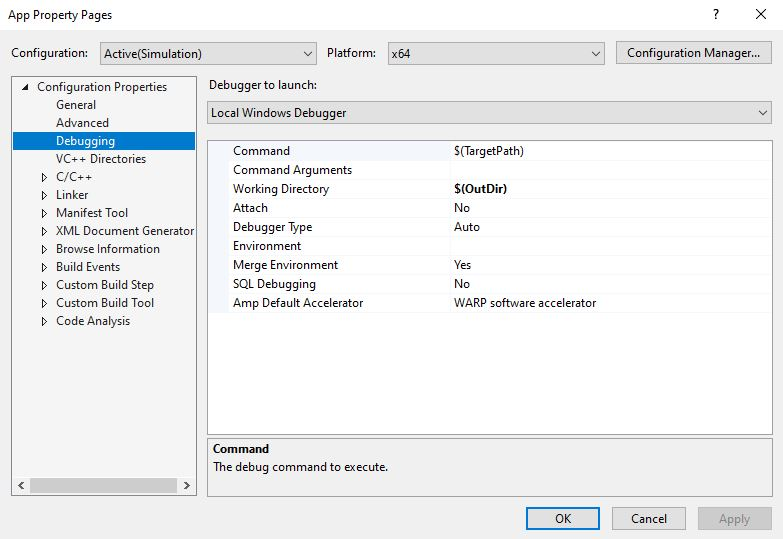
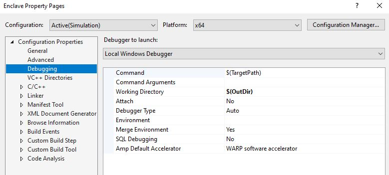
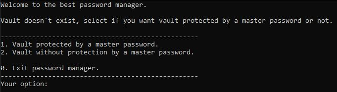
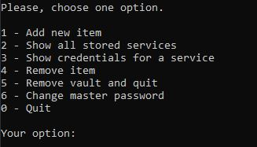

# Intel SGX password manager
## Requirements
- Visual Studio Community 2019
	- https://visualstudio.microsoft.com/cs/vs/
	- 
- Intel SGX SDK v2.12.101.2
	- https://software.intel.com/content/www/us/en/develop/topics/software-guard-extensions/sdk.html
- Windows 10
	
### VS Configuration
- Clone repo and open **IntelSGXPasswordManager.sln**
- Set Solution Configuration to Simulation and platform to x64
	- 
- In the App Project properties set Debugging Working Directory to $(OutDir)
	- 
- Also in the Enclave Project properties set Debugging Working Directory to $(OutDir)
	- 
- Build project and start

## Program
- First of all you decide, whether you want to protect your vault with master password or not. Beware, there is password policy on master password(Atleast 10 chars, 1 uppercase, 1 lowercase, 1 number)
	- 
- Then you can start using password manager
	- 
- When adding new item into the vault, make sure your password fulfill requirements (Atleast 8 chars, 1 letter, 1 number).
### Possible problems
- Program won't start
	- Try to set admin privileges for project (run Visual Studio as Admin)

